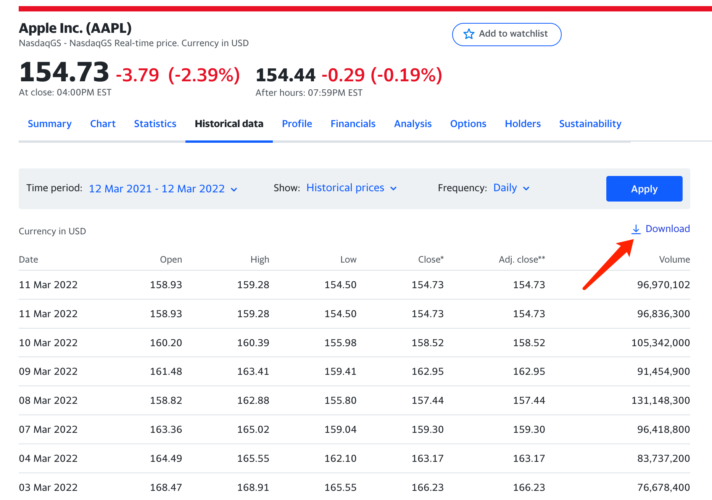
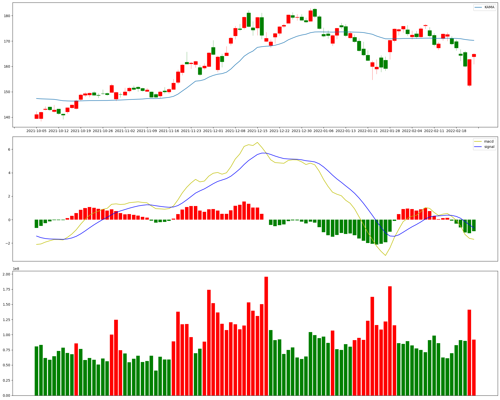

# 基于Python构建自定义图形和指标(一)
一般来说券商APP已经提供了非常丰富的图表和数据，但是架不住新手各种天马行空的想像，以及对于可以寻找到圣杯的迷之自信，所以有必要介绍一下对于自定义图形和指标的实现方式。

## 数据源
比较常见的几种数据源：财经网站、数据平台、数据接口。

### 财经网站
东方财富、新浪财经等等，此类网站很多，只是需要自己编写爬虫解析网页。

### 数据平台
大多为提供PythonAPI，比如Tushare、baostock等，不过要么需要积分要么数据涵盖补全。

### 数据接口
雅虎财经相比国内的财经网站，特别提供了获取数据的接口服务，避免了编写爬虫和熟悉各个数据平台的API。

## 获取数据
由以下网址可以访问苹果的历史数据:

[https://au.finance.yahoo.com/quote/AAPL/history?p=AAPL](https://au.finance.yahoo.com/quote/AAPL/history?p=AAPL)



由图中`Download`的链接可以得到下载历史数据的接口，格式如下：

```
https://query1.finance.yahoo.com/v7/finance/download/AAPL?period1=1615556170&period2=1647092170&interval=1d&events=history&includeAdjustedClose=true
```

因此，我们可以构建下载某个股票在指定时间范围内、指定时间周期的历史数据。

```sh
#!/bin/bash
#
# Author: greedy_alpha@163.com
#
# 基于雅虎API获取股票历史数据
# 需传入要获取的股票代码、起止时间、时间周期等参数


###############################
# 参数校验
###############################

if [ $# -lt 3 ]; then
    echo "Error: Please enter correct parameters"
    exit 1
else
    code=$1
    sday=$2
    eday=$3
    if [ $# -gt 3 ]; then
        inte=$4
    else
        inte="1d"
    fi
fi


###############################
# 基础配置
###############################

HOME=$(cd "$(dirname "$0")" || exit; pwd)
cd "$HOME" || exit;

s_tms=$(date -d ${sday} +%s)
e_tms=$(date -d ${eday} +%s)

api="https://query1.finance.yahoo.com/v7/finance/download"
args="events=history&includeAdjustedClose=true"

data_path=../../data
file_name=${code}-${sday}-${eday}-${inte}.csv

###############################
# 函数实现
###############################

get_data() {
    url="${api}/${code}?period1=${s_tms}&period2=${e_tms}&interval=${inte}&${args}"
    curl -k ${url} > ${data_path}/${file_name}
}


###############################
# 数据处理
###############################

main() {
    get_data
}

main
```

获取苹果2022年1月到2月的交易数据

```
sh get_history.sh AAPL 20220101 20220228
```

> 2022-02-14,167.369995,169.580002,166.559998,168.880005,168.880005,86185500
> 
> 2022-02-15,170.970001,172.949997,170.250000,172.789993,172.789993,62527400
> 
> 2022-02-16,171.850006,173.339996,170.050003,172.550003,172.550003,61177400
> 
> 2022-02-17,171.029999,171.910004,168.470001,168.880005,168.880005,69589300
> 
> 2022-02-18,169.820007,170.539993,166.190002,167.300003,167.300003,82772700

## 自定义图形和指标

有了数据，接下来就可以绘制自定义的图形和指标。

关于指标，[TA-Lib](https://mrjbq7.github.io/ta-lib/)库提供了相当丰富的技术分析指标。
关于图形，[mplfinance](https://github.com/matplotlib/mplfinance)库提供了金融数据可视化的基本功能。

这里以[KAMA-考夫曼均线](https://school.stockcharts.com/doku.php?id=technical_indicators:kaufman_s_adaptive_moving_average)为例进行绘图。相比于普通均线，KAMA添加了平滑系数，在一定程度上缓解了普通均线在短时间周期时过于灵敏、长时间周期又过于迟钝的问题。

``` python
def indicators_kama():
    data["kama"] = talib.KAMA(data["Close"], timeperiod=30)
```

画图时按三行一列的布局。

``` python
fig = plt.figure()
fig.set_size_inches((20, 16))
ax_main = fig.add_subplot(3, 1, 1)
# 后面两个图使用与 ax_main 相同的 X 轴
ax_macd = fig.add_subplot(3, 1, 2, sharex=ax_main)
ax_vol = fig.add_subplot(3, 1, 3, sharex=ax_main)
```

为避免非交易日造成图形不连续, 将索引与日期做映射

``` python
def format_date(x, pos):
    if x < 0 or x > len(data.index) - 1:
        return ''
    return data.index[int(x)]
ax_main.xaxis.set_major_formatter(tk.FuncFormatter(format_date))
# X 轴五天一个间隔显示
ax_main.xaxis.set_major_locator(tk.MultipleLocator(5))
```

显示 MACD 指标时对零轴上下按不同颜色显示

``` python
ax_macd.plot(data.index, data["macd"], label="macd", color='y')
ax_macd.plot(data.index, data["macd_signal"], label="signal", color='b')
macd_hist = data[data.macd_hist >= 0].macd_hist
ax_macd.bar(macd_hist.index.tolist(), macd_hist, color='r')
macd_hist = data[data.macd_hist < 0].macd_hist
ax_macd.bar(macd_hist.index.tolist(), macd_hist, color='g')
ax_macd.get_xaxis().set_visible(False)
ax_macd.legend()
```

对于大于二十日均值的交易量按红色显示, 其它则按绿色显示

``` python
volume = data[data.Volume >= data.mavol].Volume
ax_vol.bar(volume.index.tolist(), volume, color='r')
volume = data[data.Volume < data.mavol].Volume
ax_vol.bar(volume.index.tolist(), volume, color='g')
ax_vol.get_xaxis().set_visible(False)
```

最终效果

