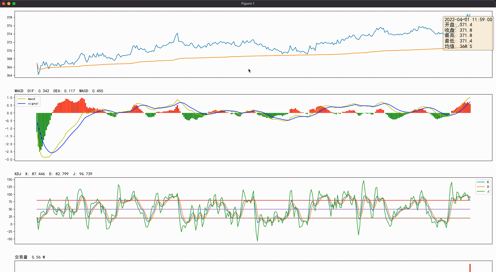

# 基于Python构建自定义图形和指标(二)
相比于历史数据，免费的实时数据获取比较困难，好在各大券商基本都提供了接口，只要开户入金后基本上都能开通获取实时数据的权限。这里主要以港美股为主的富途进行相关介绍。

## 实时数据

相比于A股对于程序化交易的限制，港美股券商提供了丰富的接口，完整文档可参见富途的开放平台：[Futu OpenAPI 介绍](https://openapi.futunn.com/futu-api-doc/)

### 实时K线

相关文档可参见：[获取实时 K 线](https://openapi.futunn.com/futu-api-doc/quote/get-kl.html)

### 资金流向

除了K线以外，富途还提供了资金流向这种基本数据。相关文档可参见：[获取资金流向](https://openapi.futunn.com/futu-api-doc/quote/get-capital-flow.html)

## 自定义图形和指标

利用上面的接口获取到实时数据后，即可显示自定义的分时图。

### 分时图中的均线

根据分时图中均线的定义：累计成交额除以累计成交量

``` python
def indicators_ma():
    data["ma"] = data['turnover'].cumsum()/data["volume"].cumsum()
```

### KDJ指标

`KDJ` 指标需要使用 `talib.STOCH` 进行计算，但即使如此，计算得到的数值仍然与常见平台的数值有差异。

``` python
def indicators_kdj():
    data["K"], data["D"] = talib.STOCH(data["high"].values,
        data["low"].values,
        data["close"].values,
        fastk_period=9,
        slowk_period=3,
        slowk_matype=0,
        slowd_period=3,
        slowd_matype=0)
    data["J"] = 3 * data["K"] - 2 * data["D"]
```

### 事件处理

相比于上一节的图形，此节添加事件处理，使其在鼠标移动时显示对应时间点的数据。

显示数据采用文本和标题的方式，即当鼠标进入子图时，生成当前时间的开盘、收盘、最高、最低等数据拼成的文本信息，并修改各个指标字图的标题。

#### 事件注册

添加进出 `axes` 和移动鼠标的事件处理

``` python
fig.canvas.mpl_connect('axes_enter_event', enter_axes)
fig.canvas.mpl_connect('axes_leave_event', leave_axes)
fig.canvas.mpl_connect('motion_notify_event', on_move)
```

#### 移出子图

当鼠标移出子图时设置文本框为隐藏。

``` python
def leave_axes(event):
    ax = event.inaxes
    if ax is None:
        return
    for text in text_data.values():
        text.set_visible(False)
    event.canvas.draw_idle()
```

#### 移入子图

当鼠标移入子图时判断鼠标位置是在左侧还是右侧，在左侧时文本框在右侧显示，在右侧时文本框在左侧显示，避免遮挡。

``` python
def enter_axes(event):
    ax = event.inaxes
    if ax is None:
        return
    idx = int(event.xdata)
    x = 0.1
    if idx < data_size / 2:
        x = 0.9
    key_show = '%.1f' % x
    if text_data.get(key_show) is not None:
        text_data[key_show].set_visible(True)
    key_hide = '%.1f' % (1-x)
    if text_data.get(key_hide) is not None:
        text_data[key_hide].set_visible(False)
    event.canvas.draw_idle()
```

#### 鼠标移动

当鼠标移动时依次遍历各个子图，首先获取时间，然后根据时间获取该时间点的各个指标数据，并重置标题；然后获取开盘、收盘、最高、最低、均值数据重置文本框内容；最后判断文本框应该在哪一侧显示。

``` python
def on_move(event):
    ax = event.inaxes
    if ax is None:
        return
    idx = int(event.xdata)
    if idx < 0 or idx >= data_size:
        return

    # show title
    for key, ax in axes_data.items():
        if key == "main":
            continue
        if key == "kdj":
            ax.set_title("  ".join([key.upper(), "K: %.3f" % data["K"][idx], "D: %.3f" % data["D"][idx], "J: %.3f" % data["J"][idx]]),
                loc='left', y=1, fontsize="large")
        elif key == "macd":
            ax.set_title("  ".join([key.upper(), "DIF: %.3f" % data["macd"][idx], "DEA: %.3f" % data["macd_signal"][idx], "MACD: %.3f" % (data["macd_hist"][idx]*2)]),
                loc='left', y=1, fontsize="large")
        elif key == "vol":
            ax.set_title("  ".join(["交易量", "%.2f W" % (data["volume"][idx]/10000)]),
                loc='left', y=1, fontsize="large")
        elif key == "flow":
            ax.set_title("  ".join(["资金流向", "%.2f W" % (data["flow"][idx]/10000)]),
                loc='left', y=1, fontsize="large")

    # show text
    ax = axes_data["main"]
    x, y = 0.1, 0.9
    if idx < data_size / 2:
        x = 0.9
    key_show = "%.1f" % x
    key_hide = "%.1f" % (1-x)
    textstr = '\n'.join((
        r'%s' % data["time_key"][idx],
        r'开盘: %.1f' % data["open"][idx],
        r'收盘: %.1f' % data["close"][idx],
        r'最高: %.1f' % data["high"][idx],
        r'最低: %.1f' % data["low"][idx],
        r'均值: %.1f' % data["ma"][idx]))
    text = text_data.get(key_show)
    if text is None:
        text = ax.text(x, y, textstr, transform=ax.transAxes, fontsize=14,
                       verticalalignment='top', bbox=props, clip_on=False)
        text_data[key_show] = text
    else:
        if text_data.get(key_hide) is not None:
            text_data[key_hide].set_visible(False)
        if not text.get_visible():
            text.set_visible(True)
        text.set_text(textstr)

    event.canvas.draw_idle()
```

最终效果

