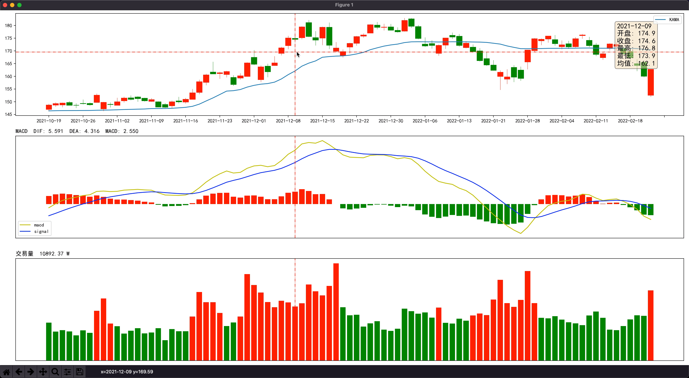
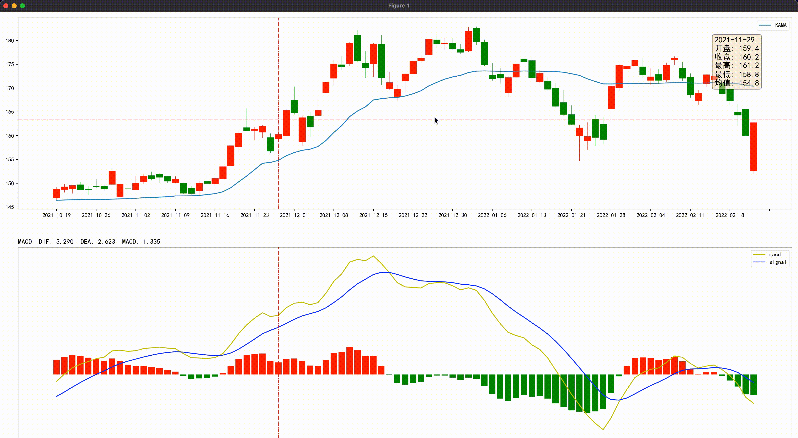
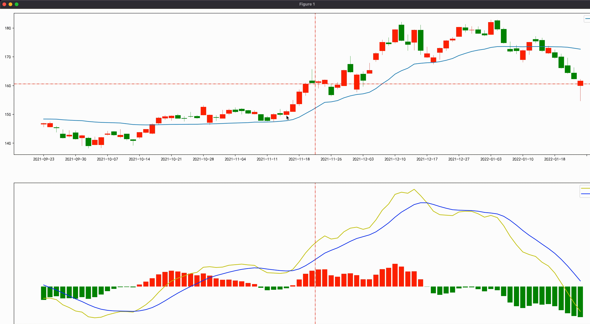
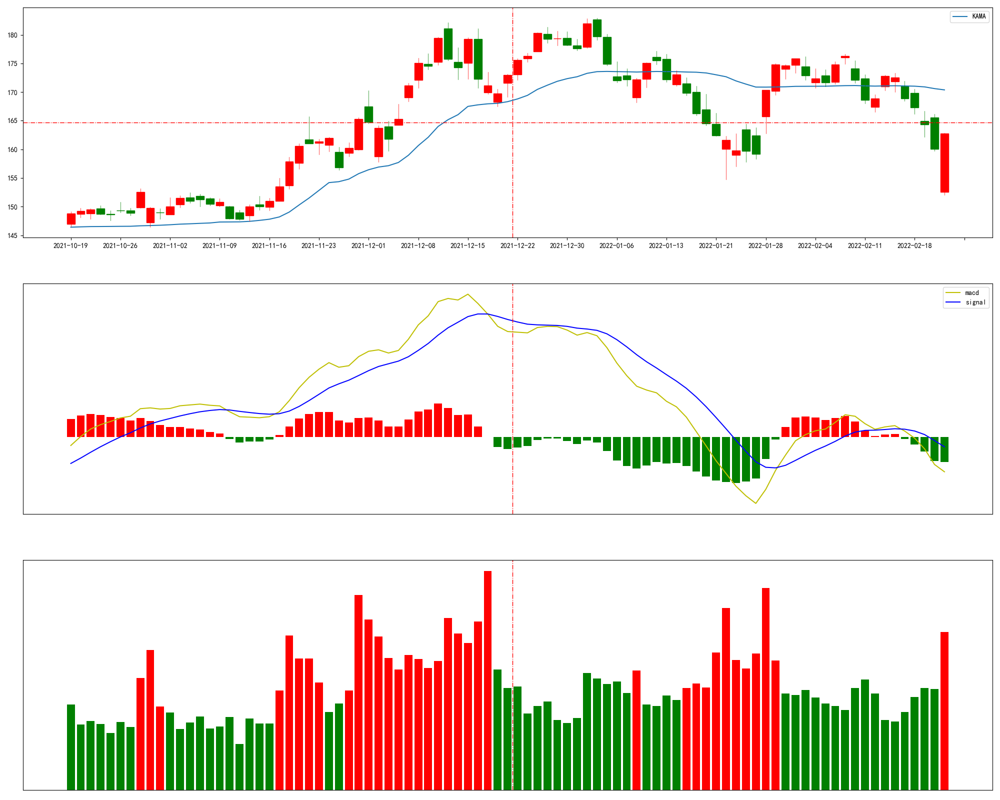

# 基于Python构建自定义图形和指标(三)
添加移动鼠标时的交互之后，相比于各个券商APP上的K线，还差拖动和放大、缩小、十字光标的交互功能。

十字光标


鼠标拖动


鼠标缩放



## 鼠标拖动

拖动K线时要做的操作是按下鼠标，然后平行移动，最后松开鼠标，因此需要绑定针对这些事件的处理。

``` python
fig.canvas.mpl_connect('button_press_event', button_press)
fig.canvas.mpl_connect('button_release_event', button_release)
```

### 按下鼠标

因为是要在松开鼠标后才真正移动K线，因此需要记录鼠标按下时的坐标，并标记目前鼠标已按下。

``` python
def button_press(event):
    global current_x, button_flag
    idx = int(event.xdata)
    current_x = idx
    button_flag = True
```

再次移动时，各个指标的数据可以不用跟随鼠标移动而动态显示对应的数值。

``` python
def on_move(event):
    if button_flag:
        return
```

### 松开鼠标

松开鼠标时，根据拖动到的新位置与之前鼠标按下时的位置做差求得距离，然后在默认显示90天的基础上修改起止日期，重新获取数据，然后对子图和画布都做清理后重新显示。

``` python
def button_release(event):
    global current_x, button_flag
    button_flag = False

    idx = int(event.xdata)
    diff = idx - current_x
    global s_idx, e_idx, show_data
    s_idx -= diff
    e_idx -= diff
    if e_idx > 0:
        e_idx = -1
        s_idx = -90
    show_data = data[s_idx: e_idx]
    
    for ax in axes_data.values():
        ax.cla()
        plt.clf()

    show_chart()
    
    current_x = -1
```

## 放大缩小

要实现放大缩小实际上就是对鼠标的滚轮事件做处理。

``` python
fig.canvas.mpl_connect('scroll_event', on_scroll)
```

设置默认显示90天的数据，当放大缩小时，每次在当前基础上变化10%，然后用新的起止日期获取数据，清理当前画布后重新显示新数据。

``` python
def on_scroll(event):
    ax = event.inaxes
    if ax is None:
        return
    global s_idx, e_idx, show_data
    diff = int(data_size * 0.1 / 2)
    if event.button == "down":
        s_idx += diff
        e_idx -= diff
    elif event.button == "up":
        s_idx -= diff
        e_idx += diff
    if e_idx > 0:
        e_idx = -1
    show_data = data[s_idx: e_idx]
    for ax in axes_data.values():
        ax.cla()
        plt.clf()
    show_chart()
```

## 十字光标
`matplotlib` 自带有两种光标，一种是在单子图中显示，另外一种是在多子图中显示，但多子图显示时十字会出现在所有的子图中，因此这里仿照 `MultiCursor` 的实现方式对 `motion_notify_event` 的事件处理函数进行改造。

使用 `dict` 结构存储垂直线和水平线，它们的 `key` 为子图的名字，`value` 即为 `matplotlib` 中的 `line` 对象

``` python
vlines = {}
hlines = {}
```

在图表显示时默认在所有子图中显示垂直线，只在K线所在的子图中显示水平线。其中垂直线的X轴坐标即为当前显示数据大小的一半，水平线的Y轴坐标即为当前显示数据中最高价的最高值与最低价的最低值做差，获取显示区域Y轴的距离，再用最低价的最低值加上其一半的值即为水平线的Y轴坐标。

``` python
def show_chart():
    xmid = data_size/2
    ymid = min(show_data["Low"]) + (max(show_data["High"]) - min(show_data["Low"]))/2
    vlines = dict([(key, ax.axvline(xmid, color="r", lw=1, ls="dashdot"))
                           for key, ax in axes_data.items()])
    hlines = {"main": ax_main.axhline(ymid, visible=True, color="r", lw=1, ls="dashdot")}
```

当鼠标移动时，需要动态显示垂直线和水平线。

``` python
fig.canvas.mpl_connect('motion_notify_event', on_move)
fig.canvas.mpl_connect('draw_event', clear)
```

在 `draw_event` 的处理函数中获取 `background` 以加速动态显示，并将垂直线和水平线都设为不可见。

``` python
def clear(event):
    global background
    background = (fig.canvas.copy_from_bbox(fig.bbox))
    for line in vlines.values():
        line.set_visible(False)
    for line in hlines.values():
        line.set_visible(False)
```

在鼠标移动时垂直线可以直接显示，但对于水平线，要看鼠标当前移动到了哪个子图上，只显示鼠标所在子图上的水平线。

``` python
def on_move(event):
    # 垂直线直接显示
    for line in vlines.values():
        line.set_xdata(idx)
        line.set_visible(True)
        
    # 标记是否找到了鼠标所在的子图
    find = False
    # 初始化时只在K线所在的子图创建了水平线, 因此需要先判断鼠标是否在具有水平线的子图上
    for key, line in hlines.items():
        ax = axes_data.get(key)
        if ax is not None and event.inaxes == ax:
            line.set_ydata(event.ydata)
            line.set_visible(True)
            find = True
        else:
            line.set_visible(False)
    # 如果没有找到说明鼠标移动到了尚未创建水平线的子图上, 需要新建水平线
    if not find:
        for key, ax in axes_data.items():
            if event.inaxes != ax:
                continue
            hlines[key] = ax.axhline(event.ydata, visible=True, color="r", lw=1, ls="dashdot")
    # 使用 background, draw_artist, blit 等加速动态显示
    if background is not None:
        fig.canvas.restore_region(background)
    for key, ax in axes_data.items():
        line = vlines.get(key)
        if line is not None:
            ax.draw_artist(line)
        line = hlines.get(key)
        if line is not None:
            ax.draw_artist(line)
    fig.canvas.blit()
```

## 最终效果



完整代码参见：[https://github.com/just4alpha/GreedyAlpha](https://github.com/just4alpha/GreedyAlpha)