# 基于通达信进行交易策略回测

通达信中的“程序交易评测系统”可以对量化交易策略进行回测，提供评测项非常丰富的评测报告以供进一步分析使用。

## 交易策略

在通达信界面按 Ctrl+F 调出公式管理器，在“专家系统公式”中新建自定义的公式。

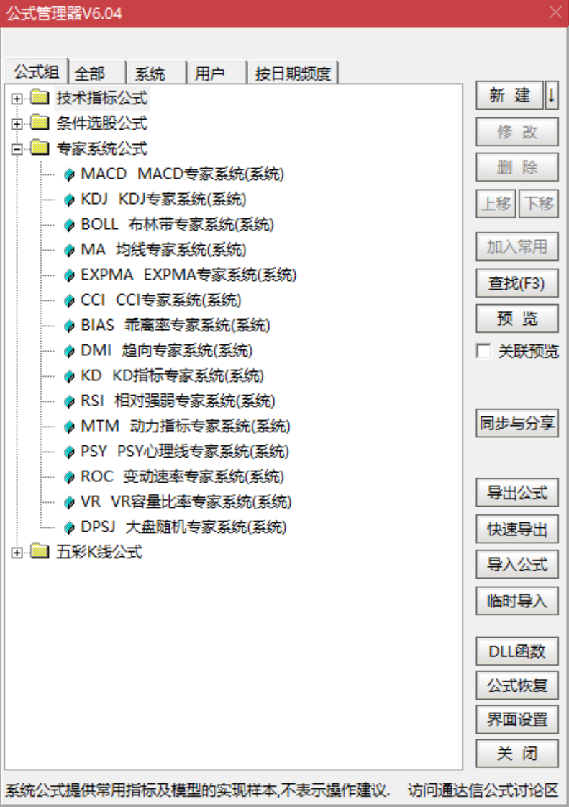

我们假定一个交易策略进行测试。比如当MACD指标触底反弹时，大多情况下股价也会上涨，因此我们假定：当MACD指标已经连涨三天，且三天前其值为近二十天的最低值时买入(即MACD触底反弹且已反弹了三天); 当MACD指标连跌三天时卖出。

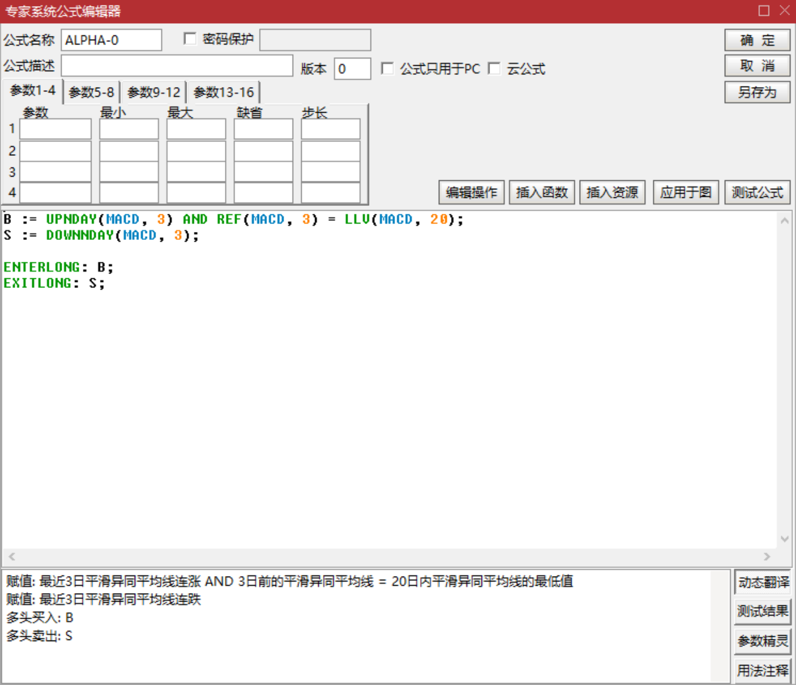

## 交易评测

然后在通达信界面按 Ctrl+S 调出程序交易评测系统，评测公式选择上一步新建的自定义公式，计算周期选择日线，复权类型选择前复权，即计算周期和复权类型都选择默认值。

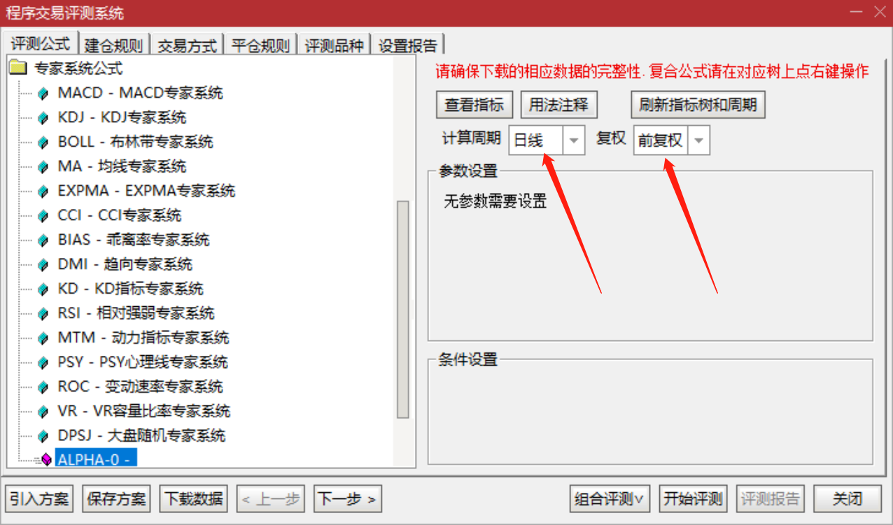

然后点击下一步进入建仓规则的设置。评测时间段暂定为两年时间，建仓规则为每次买入一万元符合的股票。

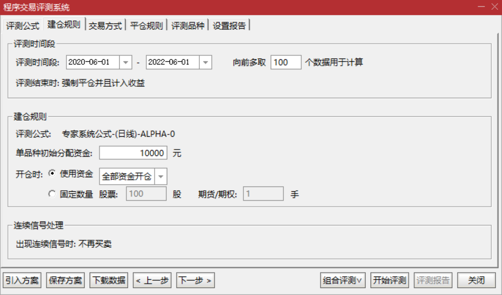

然后点击下一步进入手续费的设置。这里直接使用默认值即可。

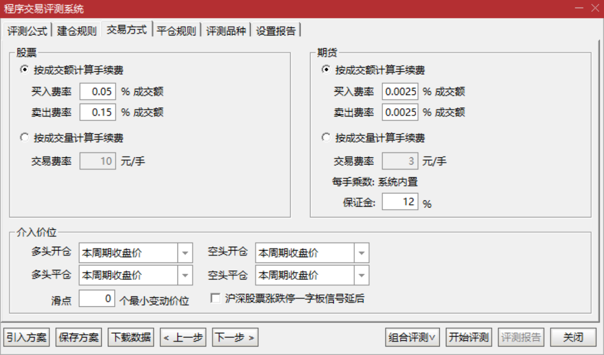

然后点击下一步进入平仓规则的设置。因为在自定义公式里已经设置了卖出的规则，因此这里不做任何调整。

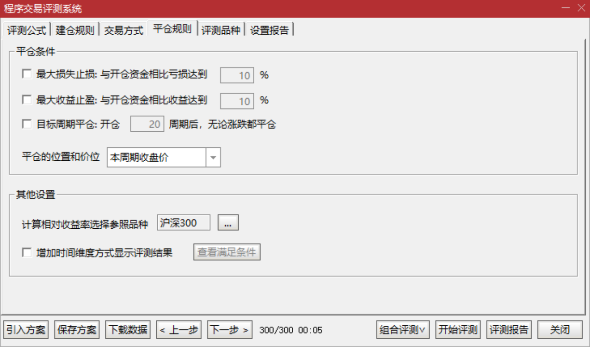

然后点击下一步进入评测品种的设置。因为上一步的收益率参照对象为沪深300，因此这里将沪深300的成分股作为评测品种。

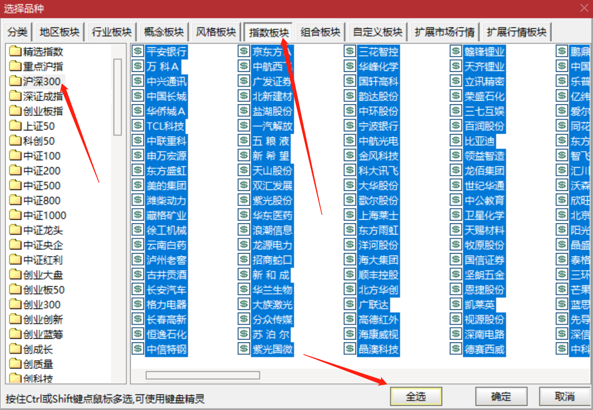

然后点击下一步进入设置报告页面。可以在这里检测一下自己设置的条件是否符合预期，然后点击开始评测。

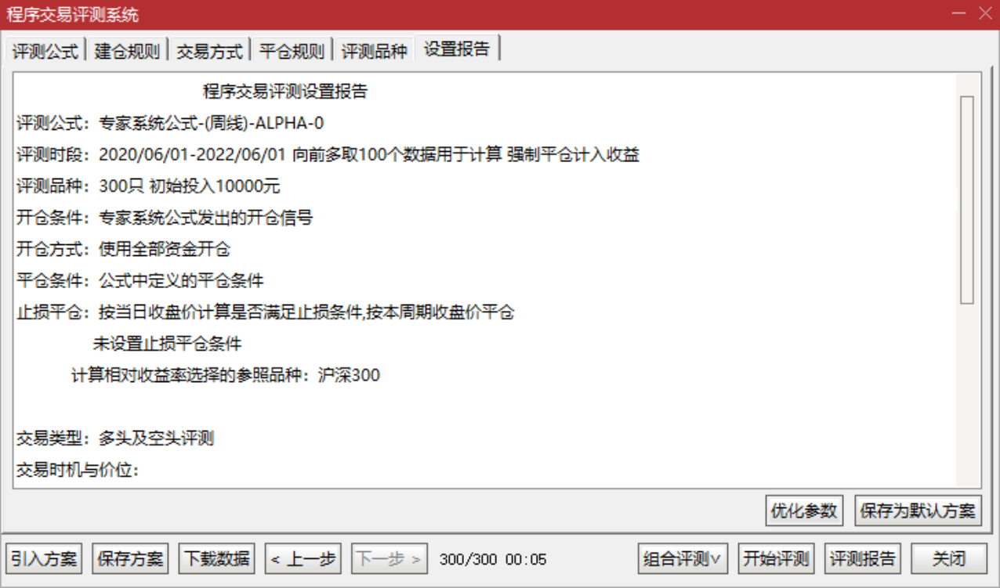

## 评测报告

评测结束后在弹出的界面中点选综合统计，可以看到交易策略在指定时间段内的整体成绩。

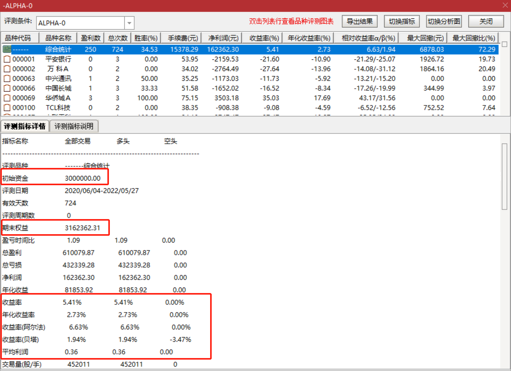

一个交易策略必然不会适合于所有的股票，所以可以双击某个股票查看该策略买卖点，以进一步分析可以以对策略进行改进。

比如点击收益率，股票列表将会按收益率从高到低排序，此时收益率最高的股票为长城汽车，收益率近500%，双击进入该股票的详情页以查看详情。

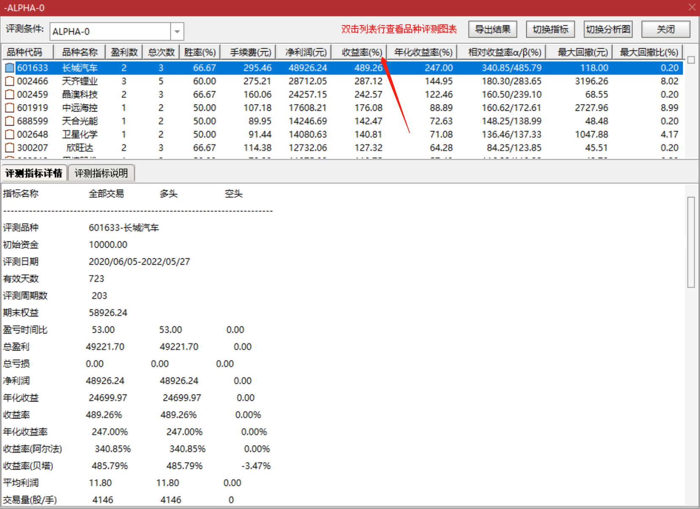

选中“在K线图上显示信号”，即可在K线上显示红绿箭头的买卖信号，结合下方在不同日期的买平、卖平记录即可进行详细分析。

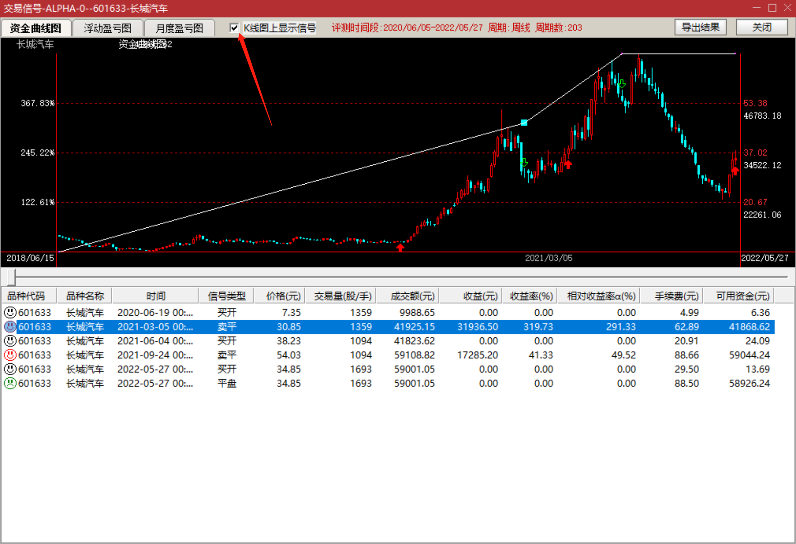

