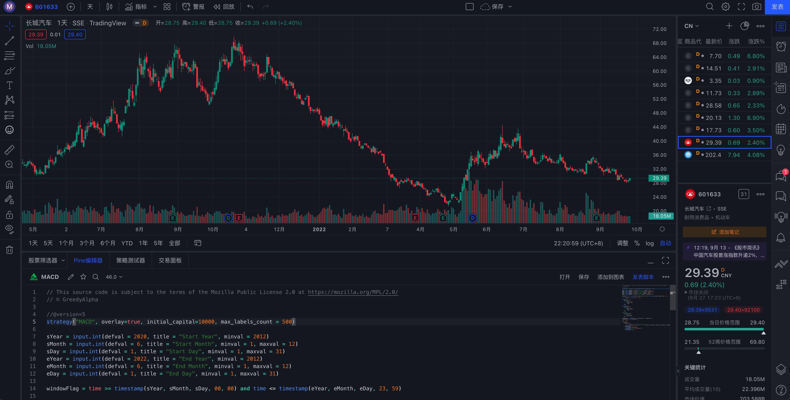
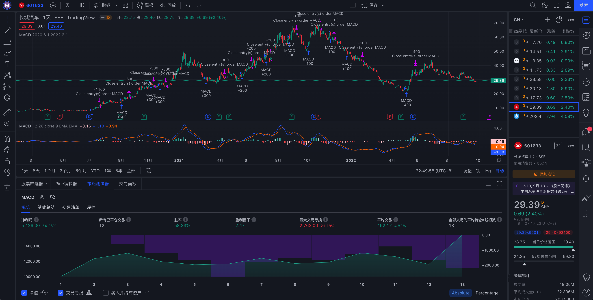

# 基于TradingView进行交易策略回测
[TradingView](https://cn.tradingview.com/chart/)大概是最专业、最强大的图片工具, 不仅可以很方便的查看行情, 还可以图形化的查看策略回测结果。

首先看一下 **TradingView** 的界面(网页版)



左上部为K线图, 可以随意调整时间周期以及添加各种指标, 除了内置指标, 还可以添加网友分享的指标、策略

左下部为编辑区, 可以编辑自定义的 **Pine** 脚本, 相关文档可参见:[Pine脚本语言参考手册
](https://cn.tradingview.com/pine-script-reference/v5/)

右上部为自选列表, 可以按不同的市场(美股、港股、A股)添加自选

右下部为详情页面, 当选中某个标的时会显示相关详情

此外左侧边栏为画图工具, 右侧边栏为功能列表, 可以查看新闻、与网友交流等


## 交易策略

这里使用与前面在通达信中进行回测时相同的策略：当MACD指标连涨三天且起涨点为近20天的最低值时买入; 当MACD指标连跌三天时卖出

## 交易评测

``` pine
// This source code is subject to the terms of the Mozilla Public License 2.0 at https://mozilla.org/MPL/2.0/
// © GreedyAlpha

// 1. 声明 Pine 脚本的版本
//@version=5
// 2. 定义策略, 包括策略名称、初始资金等, 完整的参数列表可以在界面内按下 ⌘ 键后再用鼠标点击某个函数的方式跳转到文档页
strategy("MACD", overlay=true, initial_capital=10000, max_labels_count = 500)

// 3. 设置用于回测的时间窗口
// 为与前面通达信回测时的时间范围相同进行了相关设置
sYear = input.int(defval = 2020, title = "Start Year", minval = 2012)
sMonth = input.int(defval = 6, title = "Start Month", minval = 1, maxval = 12)
sDay = input.int(defval = 1, title = "Start Day", minval = 1, maxval = 31)
eYear = input.int(defval = 2022, title = "End Year", minval = 2012)
eMonth = input.int(defval = 6, title = "End Month", minval = 1, maxval = 12)
eDay = input.int(defval = 1, title = "End Day", minval = 1, maxval = 31)

windowFlag = time >= timestamp(sYear, sMonth, sDay, 00, 00) and time <= timestamp(eYear, eMonth, eDay, 23, 59)

// 4. 获取 MACD 指标
[_, _, histLine] = ta.macd(close, 12, 26, 9)

// 5. 在 TV 中没有通达信中的 upnday 函数, 因此这里自行实现
upnday(a, n) =>
    bool flag = true
    for i = 1 to n
        if a[i] >= a[i-1]
            flag := false
            break
    flag

// 6. 在 TV 中也没有通达信中的 downnday 函数, 因此也要自行实现
downnday(a, n) =>
    bool flag = true
    for i = 1 to n
        if a[i] <= a[i-1]
            flag := false
            break
    flag

// 7. 同样在 TV 中实现获取 N 天内最小值的函数
llv(a, n) =>
    float minV = a[0]
    for i = 1 to n
        if a[i] < minV
            minV := a[i]
    minV

// 8. 按照策略判断买卖时机
longCondition = upnday(histLine, 3) and histLine[3] == llv(histLine, 20)
shortCondition = downnday(histLine, 3)

// 9. 设定初始资金为一万元
total = 10000

if windowFlag
    if longCondition
        // A股中一手为一百股
        n = int(total/close/100)*100
        strategy.entry("MACD", strategy.long, n)
    if shortCondition
        // A股中不能做空所以调用 close 平仓
        strategy.close("MACD")
```
## 评测报告

编辑完成后点击“添加到图表”即可看到策略的回测结果


左上部原来的K线图中会自动显示在指定时间范围内的策略买卖点

右下部会显示策略的各种指标: 净利润、胜率、回撤、净值等

点击“交易清单”可以看到每一次建仓、平仓的执行时间和仓位情况, 可以结合K线图以及MACD指标进行后续的优化