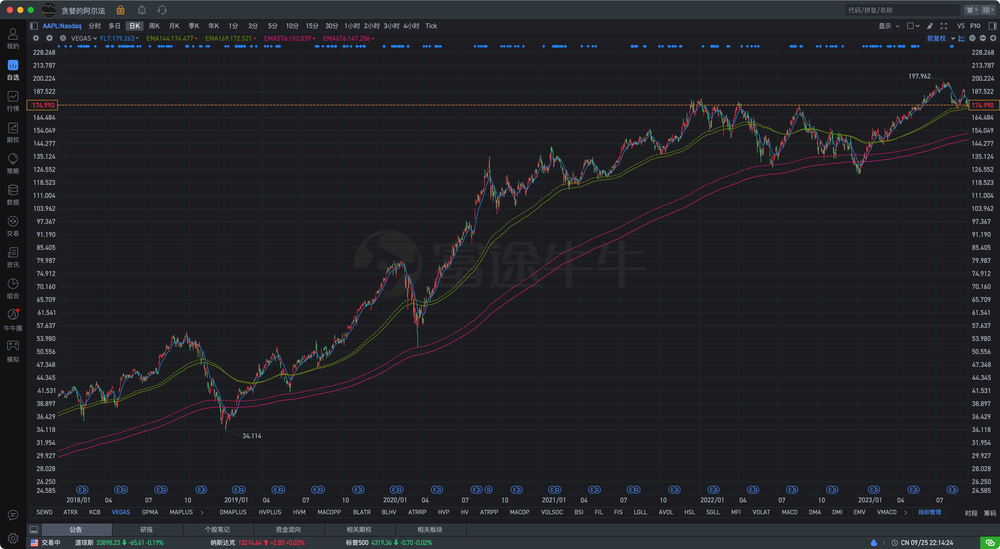
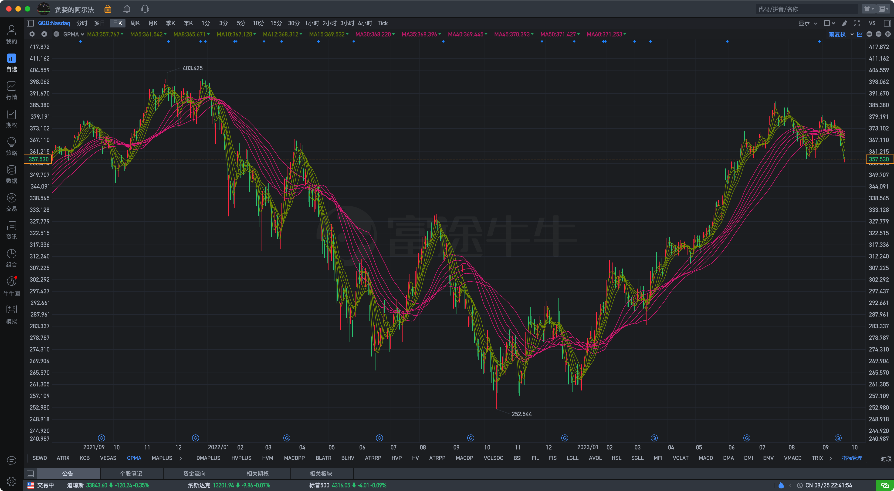

# 基于均线指标的各种扩展、实现
股市总是在不定周期的趋势、震荡中循环，因此技术指标可分为三大类：趋势指标、震荡指标、其它指标。而均线指标正是趋势类指标的基础。

## SMA
简单移动平均线，即指定周期内的均值。
## EMA
指数移动平均线，即指定周期内经指数平滑后的均值。
## WMA
加权移动平均线，即指定周期内以索引为权重后的均值。
## DEMA
双重指数移动均线，即对EMA再次求EMA，然后与原EMA的两倍值做差。因为经过双重处理，使得该指标进一步提升了敏感性。
## SEWD
可以将 SMA + EMA + WMA +DEMA 放在一起构成 SEWD 指标进行对比。

```
ST := 10;
MT := 60;

{SMA 用实线}
SS: MA(C, ST), COLOR7F9A00;
SM: MA(C, MT), COLORE51883;

{EMA 用虚线}
ES: EMA(C, ST), DOTLINE, COLOR7F9A00;
EM: EMA(C, MT), DOTLINE, COLORE51883;

{WMA 用圈线}
WS: WMA(C, ST), CIRCLEDOT, COLOR7F9A00;
WM: WMA(C, MT), CIRCLEDOT, COLORE51883;

{DEMA 用叉线}
DS: 2 * EMA(C, ST) - EMA(EMA(C, ST), ST), CROSSDOT, COLOR7F9A00;
DM: 2 * EMA(C, MT) - EMA(EMA(C, MT), MT), CROSSDOT, COLORE51883;
```

下面是 特斯拉 在2022年到2023年的走势图，能够更明显的看出它们的差异。DEMA 最快，WMA其次，EMA再次，SMA最慢。在趋势的形成过程中，DEMA依次上穿/下穿其它均线，相同周期的不同类型均线亦可形成多头/空头排列。


## DMA
平行线差指标，即根据快慢两条均线的差值来分析趋势。

系统自带的DMA指标只显示了两条均线，对其进行增强，添加差值的柱型图。

```
ST := 10;
MT := 10;
LT := 50;

DDD := MA(C, ST) - MA(C, LT);
DAMA := MA(DDD, MT);

DIFF := DDD - DAMA;
DIFF_ := REF(DIFF, 1);

UU := IF(DIFF > 0 AND DIFF >= DIFF_, DIFF, DRAWNULL);
UD := IF(DIFF > 0 AND DIFF < DIFF_, DIFF, DRAWNULL);
DD := IF(DIFF < 0 AND DIFF < DIFF_, DIFF, DRAWNULL);
DU := IF(DIFF < 0 AND DIFF >= DIFF_, DIFF, DRAWNULL);

STICKLINE(UU > 0, 0, DIFF, 0.8, 0), COLORFF5252;
STICKLINE(UD > 0, 0, DIFF, 0.8, 0), COLORFFCDD2;
STICKLINE(DD < 0, DIFF, 0, 0.8, 0), COLOR26A69A;
STICKLINE(DU < 0, DIFF, 0, 0.8, 0), COLORB2DFDB;

快线: DDD, COLOR7F9A00;
慢线: DAMA, COLORE51883;
```

下面是 英伟达 在2022年到2023年的走势图，可以看到两个指标走势、数值相同，但增强版能够更直观的显示细节。


## VEGAS
Vegas隧道，即以MA144、169为中期趋势，4倍的MA576、676为长期趋势，同时以MA12为过滤线(过滤掉价格突破但MA12没有突破的假信号)的交易法则。

```
FLT: EMA(C, 12), COLORBLUE;

EMA144: EMA(C, 144), DOTLINE, COLOR7F9A00;
EMA169: EMA(C, 169), COLOR7F9A00;

EMA576: EMA(C, 576), DOTLINE, COLORE51883;
EMA676: EMA(C, 676), COLORE51883;
```
下面是 苹果 在2018年到2023年的走势图，可以看到以长期趋势(MA576、676)没有改变时，当中期回调后，MA12再次上穿MA144、169时即为做多的时间节点。


## GPMA
顾比均线，即以短期、长期两组均线进行波动交易。其中短期均线周期为3、5、8、10、12、15，长期均线周期为30、35、40、45、50、60。

```
MA3: MA(C, 3), COLOR7F9A00;
MA5: MA(C, 5), COLOR7F9A00;
MA8: MA(C, 8), COLOR7F9A00;
MA10: MA(C, 10), COLOR7F9A00;
MA12: MA(C, 12), COLOR7F9A00;
MA15: MA(C, 15), COLOR7F9A00;

MA30: MA(C, 30), COLORE51883;
MA35: MA(C, 35), COLORE51883;
MA40: MA(C, 40), COLORE51883;
MA45: MA(C, 45), COLORE51883;
MA50: MA(C, 50), COLORE51883;
MA60: MA(C, 60), COLORE51883;
```

下面是 QQQ 在2021年到2023年的走势图。可以看到长期均线的阻力和支撑作用，以及趋势逆转时均线的粘合。



## MUMA
多重均线，即仿照顾比均线，添加更多的等距均线，同时将其视为一个整体，不再区分短期组、长期组，且当处于上涨趋势时设置一个颜色，下跌趋势时设置另外一个颜色，更一目了然的观察趋势的变化。

```
BULLISH := MA(C, 20) > MA(C, 60) AND MA(C, 60) > MA(C, 120)
BEARISH := MA(C, 20) < MA(C, 60) AND MA(C, 60) < MA(C, 120)

MA(C, 12), COLORFEF6E1;
IF(BULLISH, (MA(C, 12), COLORE51883), DRAWNULL);
IF(BEARISH, (MA(C, 12), COLOR7F9A00), DRAWNULL);

MA(C, 16), COLORFEF6E1;
IF(BULLISH, (MA(C, 16), COLORE51883), DRAWNULL);
IF(BEARISH, (MA(C, 16), COLOR7F9A00), DRAWNULL);

MA(C, 20), COLORFEF6E1;
IF(BULLISH, (MA(C, 20), COLORE51883), DRAWNULL);
IF(BEARISH, (MA(C, 20), COLOR7F9A00), DRAWNULL);

MA(C, 24), COLORFEF6E1;
IF(BULLISH, (MA(C, 24), COLORE51883), DRAWNULL);
IF(BEARISH, (MA(C, 24), COLOR7F9A00), DRAWNULL);

MA(C, 28), COLORFEF6E1;
IF(BULLISH, (MA(C, 28), COLORE51883), DRAWNULL);
IF(BEARISH, (MA(C, 28), COLOR7F9A00), DRAWNULL);

MA(C, 32), COLORFEF6E1;
IF(BULLISH, (MA(C, 32), COLORE51883), DRAWNULL);
IF(BEARISH, (MA(C, 32), COLOR7F9A00), DRAWNULL);

MA(C, 36), COLORFEF6E1;
IF(BULLISH, (MA(C, 36), COLORE51883), DRAWNULL);
IF(BEARISH, (MA(C, 36), COLOR7F9A00), DRAWNULL);

MA(C, 40), COLORFEF6E1;
IF(BULLISH, (MA(C, 40), COLORE51883), DRAWNULL);
IF(BEARISH, (MA(C, 40), COLOR7F9A00), DRAWNULL);

MA(C, 44), COLORFEF6E1;
IF(BULLISH, (MA(C, 44), COLORE51883), DRAWNULL);
IF(BEARISH, (MA(C, 44), COLOR7F9A00), DRAWNULL);

MA(C, 48), COLORFEF6E1;
IF(BULLISH, (MA(C, 48), COLORE51883), DRAWNULL);
IF(BEARISH, (MA(C, 48), COLOR7F9A00), DRAWNULL);

MA(C, 52), COLORFEF6E1;
IF(BULLISH, (MA(C, 52), COLORE51883), DRAWNULL);
IF(BEARISH, (MA(C, 52), COLOR7F9A00), DRAWNULL);

MA(C, 56), COLORFEF6E1;
IF(BULLISH, (MA(C, 56), COLORE51883), DRAWNULL);
IF(BEARISH, (MA(C, 56), COLOR7F9A00), DRAWNULL);

MA(C, 60), COLORFEF6E1;
IF(BULLISH, (MA(C, 60), COLORE51883), DRAWNULL);
IF(BEARISH, (MA(C, 60), COLOR7F9A00), DRAWNULL);

MA(C, 64), COLORFEF6E1;
IF(BULLISH, (MA(C, 64), COLORE51883), DRAWNULL);
IF(BEARISH, (MA(C, 64), COLOR7F9A00), DRAWNULL);

MA(C, 68), COLORFEF6E1;
IF(BULLISH, (MA(C, 68), COLORE51883), DRAWNULL);
IF(BEARISH, (MA(C, 68), COLOR7F9A00), DRAWNULL);

MA(C, 72), COLORFEF6E1;
IF(BULLISH, (MA(C, 72), COLORE51883), DRAWNULL);
IF(BEARISH, (MA(C, 72), COLOR7F9A00), DRAWNULL);

MA(C, 76), COLORFEF6E1;
IF(BULLISH, (MA(C, 76), COLORE51883), DRAWNULL);
IF(BEARISH, (MA(C, 76), COLOR7F9A00), DRAWNULL);

MA(C, 80), COLORFEF6E1;
IF(BULLISH, (MA(C, 80), COLORE51883), DRAWNULL);
IF(BEARISH, (MA(C, 80), COLOR7F9A00), DRAWNULL);

MA(C, 84), COLORFEF6E1;
IF(BULLISH, (MA(C, 84), COLORE51883), DRAWNULL);
IF(BEARISH, (MA(C, 84), COLOR7F9A00), DRAWNULL);

MA(C, 88), COLORFEF6E1;
IF(BULLISH, (MA(C, 88), COLORE51883), DRAWNULL);
IF(BEARISH, (MA(C, 88), COLOR7F9A00), DRAWNULL);

MA(C, 92), COLORFEF6E1;
IF(BULLISH, (MA(C, 92), COLORE51883), DRAWNULL);
IF(BEARISH, (MA(C, 92), COLOR7F9A00), DRAWNULL);

MA(C, 96), COLORFEF6E1;
IF(BULLISH, (MA(C, 96), COLORE51883), DRAWNULL);
IF(BEARISH, (MA(C, 96), COLOR7F9A00), DRAWNULL);

MA(C, 100), COLORFEF6E1;
IF(BULLISH, (MA(C, 100), COLORE51883), DRAWNULL);
IF(BEARISH, (MA(C, 100), COLOR7F9A00), DRAWNULL);

MA(C, 104), COLORFEF6E1;
IF(BULLISH, (MA(C, 104), COLORE51883), DRAWNULL);
IF(BEARISH, (MA(C, 104), COLOR7F9A00), DRAWNULL);

MA(C, 108), COLORFEF6E1;
IF(BULLISH, (MA(C, 108), COLORE51883), DRAWNULL);
IF(BEARISH, (MA(C, 108), COLOR7F9A00), DRAWNULL);

MA(C, 112), COLORFEF6E1;
IF(BULLISH, (MA(C, 112), COLORE51883), DRAWNULL);
IF(BEARISH, (MA(C, 112), COLOR7F9A00), DRAWNULL);

MA(C, 116), COLORFEF6E1;
IF(BULLISH, (MA(C, 116), COLORE51883), DRAWNULL);
IF(BEARISH, (MA(C, 116), COLOR7F9A00), DRAWNULL);

MA(C, 120), COLORFEF6E1;
IF(BULLISH, (MA(C, 120), COLORE51883), DRAWNULL);
IF(BEARISH, (MA(C, 120), COLOR7F9A00), DRAWNULL);
```

下面是 拼多多 在2020年到2023年的走势图。相比顾比均线，可以观察到更多的趋势变化细节。


## 总结
趋势不仅有方向，还有强度，因此下一篇将会分享辅助观测趋势强度的指标。


