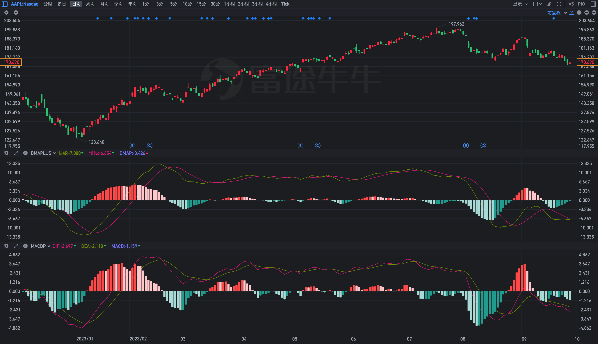
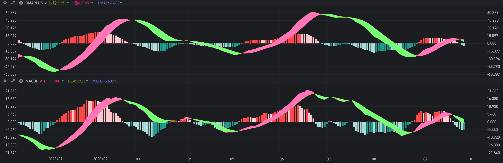
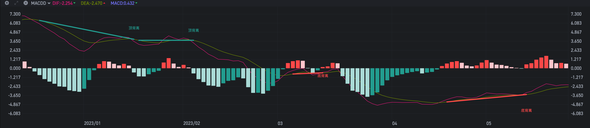

# 趋势强度指标的构建与实现
趋势的维度除了方向，还有强度。在股市中强者恒强，弱者恒弱，趋势强度类指标自然是寻找强势股的重要参考工具。

## 以差值判断强弱
暴涨暴跌会导致均线走势陡峭，如果能够持续就会导致短期、长期均线的差值增大，显然，我们可以根据不同时间周期的均线差值来判断趋势的强弱。

在上一篇均线类的指标中提到了 DMA 指标，我对其进行了增强处理，即添加了不同周期均线差值的柱型图。


### 构建
首先要找到两条不同时间周期的均线(5-20，20-60，20-120等等)，具体可以根据自己的交易周期进行选择。

然后要计算两者的差值，同时为了更便于观察，我们多计算一步，获取该差值前一天的数据，这样就可以根据两者的变化来设置不同的颜色，对趋势强度的变化一目了然。

最后根据差值的变化设置不同的颜色，并画图实现。

### 实现

首先是设置不同时间周期的均线

```
ST := 10;
MT := 10;
LT := 50;

DDD := MA(C, ST) - MA(C, LT);
DAMA := MA(DDD, MT);
```

然后计算差值，并获取前一天的数据

```
DIFF := DDD - DAMA;
DIFF_ := REF(DIFF, 1);
```

然后根据差值的变化判断强度的状态

```
{差值为正数(Plus)且在增长(Up)}
PU := IF(DIFF > 0 AND DIFF >= DIFF_, DIFF, DRAWNULL);
{差值为正数(Plus)且在下降(Down)}
PD := IF(DIFF > 0 AND DIFF < DIFF_, DIFF, DRAWNULL);
{差值为负数(Minus)且在增长(Up)}
MU := IF(DIFF < 0 AND DIFF < DIFF_, DIFF, DRAWNULL);
{差值为负数(Minus)且在下降(Down)}
MD := IF(DIFF < 0 AND DIFF >= DIFF_, DIFF, DRAWNULL);
```

最后根据不同的状态画不同的图形

```
STICKLINE(PU > 0, 0, DIFF, 0.8, 0), COLORFF5252;
STICKLINE(PD > 0, 0, DIFF, 0.8, 0), COLORFFCDD2;
STICKLINE(MD < 0, DIFF, 0, 0.8, 0), COLOR26A69A;
STICKLINE(MU < 0, DIFF, 0, 0.8, 0), COLORB2DFDB;
```

### 扩展

显然，凡是以差值判断强弱的指标都可以复用以上画柱型图的方法，比如 MACD 指标，只需要将上面 DMA 指标中的快慢线换成 DIF、DEA 即可得到变色版的 MACD 指标。

```
DIFV := EMA(C, 12) - EMA(C, 26);
DEAV := EMA(DIFV, 9);

DIFF := (DIFV - DEAV) * 2;
DIFF_ := REF(DIFF, 1);

DIF: DIFV, COLORE51883;
DEA: DEAV, COLOR7F9A00;
MACD: DIFF, COLORSTICK;

PU := IF(DIFF > 0 AND DIFF >= DIFF_, DIFF, DRAWNULL);
PD := IF(DIFF > 0 AND DIFF < DIFF_, DIFF, DRAWNULL);
MU := IF(DIFF < 0 AND DIFF < DIFF_, DIFF, DRAWNULL);
MD := IF(DIFF < 0 AND DIFF >= DIFF_, DIFF, DRAWNULL);

STICKLINE(PU > 0, 0, DIFF, 0.8, 0), COLORFF5252;
STICKLINE(PD > 0, 0, DIFF, 0.8, 0), COLORFFCDD2;
STICKLINE(MD < 0, DIFF, 0, 0.8, 0), COLOR26A69A;
STICKLINE(MU < 0, DIFF, 0, 0.8, 0), COLORB2DFDB;
```

从 苹果 2023年的走势上看，两个指标的图形大体上也是相当接近的。



当然，如果你还想让图形更漂亮一些，还可以使用 DRAWBAND 函数把两条线中间的部分填充上不同的颜色，做成带状图。



## 总结

趋势方向未变，但强度减弱，此时即为背离，下一步我们将会继续对 MACD 指标进行增强，以实现如下的效果。




