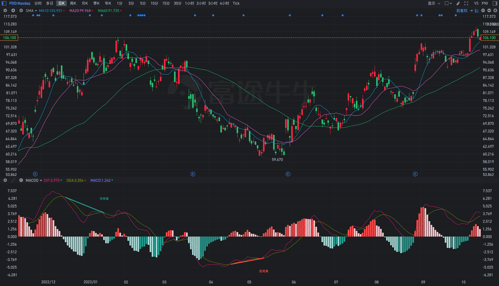

# 背离指标的构建与实现
作为中年危机的一种自我救赎方式，马拉松已经日益成为中年人的广场舞。如同速度与加速度的关系，趋势的方向不变但强度减弱，就形成了技术指标的背离。

## 背离的类型
### 趋势指标背离
最常用的自然是趋势类指标的背离，当方向与强度不一致时就会出现背离。自然，根据方向不同可分为顶背离、底背离。而方向水平时如果中间有顶底，则为隔山背离。此外还可根据单根K线的涨跌幅、换手率、成交量是否达到阈值分为单阳背离、单阴背离。

### 震荡指标背离
与趋势指标的背离类似，只不过震荡指标双端有极值，且其判断背离的阈值线不同于趋势类指标的零轴。

### 量价指标背离
量增价涨、量缩价跌想必是大家都喜欢看到的情况，否则，就要提高警惕。

### 基本面背离
除了以上的技术面背离，还有可能发生基本面背离。熊市底部，利空都不再下跌，以及牛市顶部，利好也不再上涨。

## 背离的构建
显然，技术面中趋势类的背离最容易实现。

首先要确定触发时机，即何时进行是否背离的判断。

其次要确定比较规则，即如何判断是否发生了背离。

最后，为了更直观的显示，还要在背离周期的起点和终点画线；根据顶、底背离涂不同的颜色；在终点添加标识(文字、图标)。

## 指标的实现

### 实现对 MACD 的背离识别
按照上一节提到的构建思路逐步进行实现。

首先确定触发时机。虽然使用连续两个峰值的连线进行对比是最常见的方式，但是否为峰值毕竟是要走出来之后才能知道。所以，可以采用一种变通的方式，即取 DIF 与 DEA 是否交叉(金叉或死叉)为触发时机。当然，如果趋势较强，连续两次金叉或死叉的间隔可能会很长，如何取舍，就要视自己的交易习惯而定了。

其次确定比较规则。直接取连续两次金叉或死叉时的收盘价比较大小即可，当然也可以换成 MA 或 EMA。底背离: 两次金叉位置的 DIF 值在升高而收盘价在降低；顶背离: 两次死叉位置的 DIF 值在降低而收盘价在升高。

最后基于绘图函数(DRAWLINE、DRAWTEXT)进行画线和文字标识。

```
{上一次金叉(LAST GOLDEN CROSS)到当前的周期数}
LGC := BARSLAST(REF(CROSS(DIF, DEA),1));

{当前金叉且 DIF 升高、收盘价降低则为底背离(BOTTOM DIVERGENCE)}
BD := CROSS(DIF, DEA) AND DIF > REF(DIF, LGC) AND C < REF(C, LGC);

{画线: 以上一次金叉(LGC)的 DEA 为起点，以当前金叉的 DEA 为终点}
DRAWLINE(LGC=0, DEA, BD, DEA, 0), COLORFF5252, LINETHICK3;

{标识: 满足底背离时在 DEA 的 1.6 倍处(避免遮挡)显示文字标识}
DRAWTEXT(BD, DEA*1.6, '底背离'), COLORFF5252;
```

同理可得顶背离。

以下是 拼多多 近一年的日K走势，可以看到指标识别到了两个背离。



### 实现对 KDJ 的背离识别
仿照 MACD 的实现方式：以K线、J线与D线的交叉为触发时机，相同的顶底背离的判断规则，因为 KDJ 为震荡指标，因此多添加了一个对 J 值是否大于 50 的过滤条件。

```
LGC := BARSLAST(REF(CROSS(J, D), 1));
BD := J < 50 AND CROSS(J, D) AND D > REF(D, LGC) AND C < REF(C, LGC);
DRAWLINE(LGC=0, D, BD, D, 0), COLORFF5252, LINETHICK3;
DRAWTEXT(BD, J*1.2, '底背离'), COLORFF5252;
```

以下是 特斯拉 近一年的日K走势。


### 实现对 VOL 的背离识别

成交量指标默认只有柱型图，因此如果要仿照 MACD 的实现方式，需要自己构造会交叉的两条线。显然，选定不同时间周期的均线即可。此外，因为量在价先，因此可以对原有的柱型图做一些改造：设定一条阈值线，突破时高亮显示。

首先实现对柱型图的改造: 以20周期均值的1.5倍为阈值线。

```
A :=  VOLA/10000
VOLV:VA,VOLSTICK,LINETHICK9,COLORFF8080;

UP := C > O;
DW := C <= O;
MAS := MA(VA, 1);
MAM := MA(VA, 20) * 1.5;
STICKLINE((VOLV > MAM AND UP), 0, VOLV, 0.8, 0), COLORFF5252;
STICKLINE((VOLV > MAM AND  DW), 0, VOLV, 0.8,0), COLOR26A69A;
STICKLINE((VOLV <= MAM AND UP), 0, VOLV, 0.8, 0), COLORFFCDD2;
STICKLINE((VOLV <= MAM AND  DW), 0, VOLV, 0.8,0), COLORB2DFDB;

VOLMA: MAM, COLOR7F9A00;
```
以下是 英伟达 近一年的日K走势。可以看到相比于原有的指标，添加阈值线后关键节点的异常成交量更加明显。


然后实现对背离的识别。前面提到用两个不同周期的均线，又设置了阈值线，因此将另一条均线取周期为 1 即可。

因为异常成交量一般为关键节点，因此这里以成交量突破阈值线为触发时机，同时为了避免频繁触发，限制两次间隔大于七天时才进行判断。

```
LGC := BARSLAST(REF(CROSS(MAS, MAM), 1));
BD := LGC > 7 AND CROSS(MAS, MAM) AND MAM > REF(MAM, LGC) AND C < REF(C, LGC);
DRAWLINE(LGC=0, MAM, BD, MAM, 0), COLORFF5252, LINETHICK3;
DRAWTEXT(BD, 1.1*MAS, '底背离'), COLORFF5252;
```

以下是 SPY 近两年的日K走势。


## 展望

趋势指标已经在方向、强度、背离三个维度做了一些个人不成熟的尝试，后面将会对震荡指标以及其它指标做一些分享。

