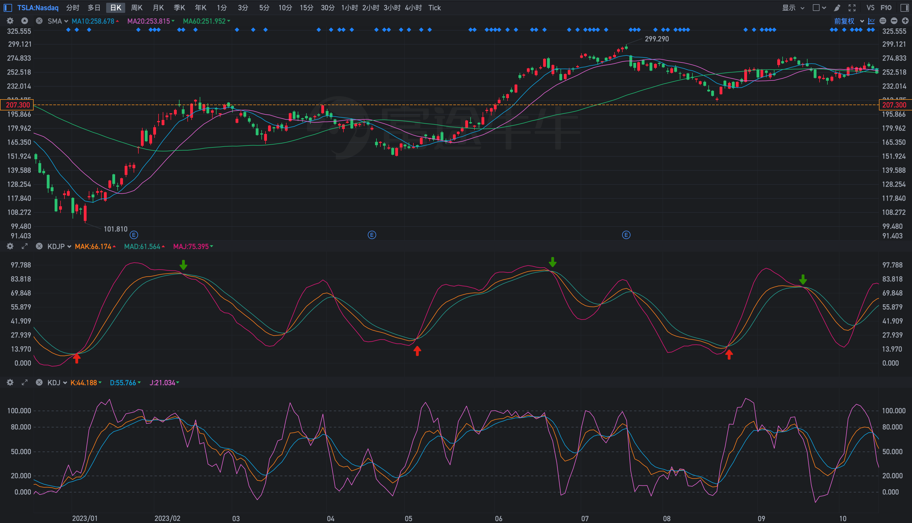
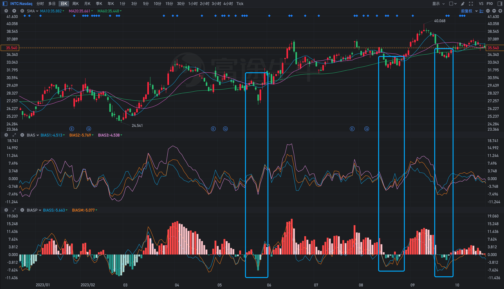
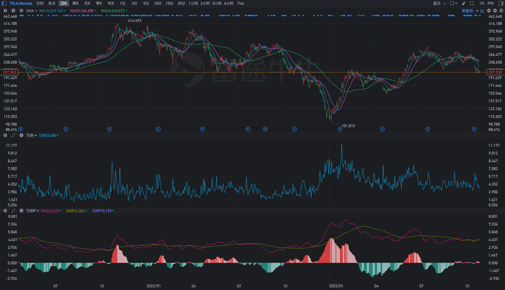
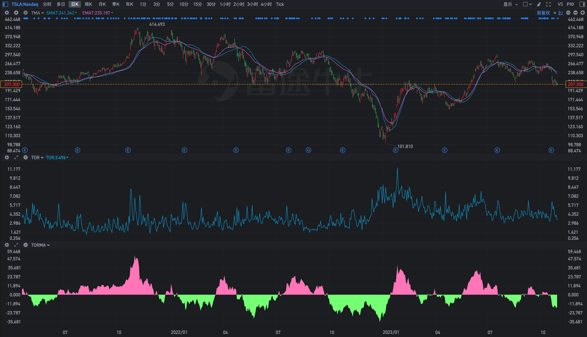
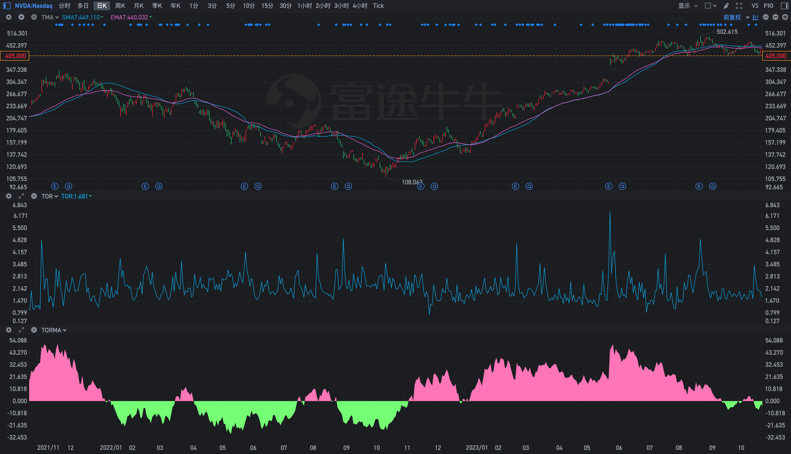
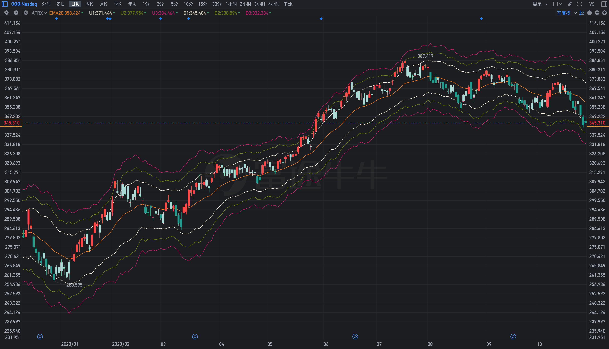

# 震荡指标的增强与扩展
上升趋势时进场，震荡趋势时纠结，下降趋势时套牢。三种趋势，按照二八原则，可能百分之八十的时间都在震荡。工欲善其事必先利其器，因此，有必要对震荡指标进行一些打磨。

常见的震荡指标自不必多说，下面主要介绍一些优化的思路以及扩展的实现。

## 解决钝化
震荡指标的最大问题可能就是钝化。解决它，可以从使用均值和设置阈值的方法入手。使用均值，从而降低了指标本身的敏感性；设置阈值，从而避免在非极值区间的频繁信号。

这里使用MA10来降低敏感性，当然，可以视自己需要进行调整。

```
T := 10;
MAK: MA(K, T), COLORFF8D1E;
MAD: MA(D,T), COLOR26A69A;
MAJ: MA(J,T), COLORE51883;
``` 

在阈值(25, 75)之内且交叉时才发出信号，使用 `DRAWICON` 函数画出特殊的图标以使信号更加直观。

```
DRAWICON(MAD < 25 && CROSS(MAK, MAD), MAD * 0.5, 1);
DRAWICON(MAD > 75 && CROSS(MAD, MAK), MAD * 1.1, 2);
```

下面是 特斯拉 近一年时间的走势图。可以看到增强版版本发出的几次信号，相比原始KDJ，在准确率上有了很大的提升。



同理，其它震荡类指标，比如RSI，也可以基于这样的思路进行优化增强。

## 乖离率
乖离率主要用于观察股价与不同周期均线的偏离程度。它的理论基础主要在于当偏离过大时就会向均值回归，因此，可以使用变色的柱状图来更直观的显示这种趋势。因为更长周期的支撑作用最强，因此只需要将股价与三条均线中最大周期的偏离程度做成柱状图即可。

```
MAS := MA(C, ST);
MAM := MA(C, MT);
MAL := MA(C, LT);

BIASS:(C - MAS) / MAS*100,LINETHICK1,COLOR0CAEE6;
BIASM:(C - MAM) / MAM*100,LINETHICK1,COLORFF8D1E;
BIASL:= (C - MAL) / MAL*100;
```

下面是 英特尔 近一年时间的走势图。其中主图的三条均线周期为10、20、60，因此，在增强版的乖离率中也使用相同的周期。这样就会明显的看到，主图中跌破MA60均线，和副图中MA60的乖离率跌破零轴，实际上就是一回事。只不过使用变色的柱状图，会更直观的观察到MA60的支撑作用。



## 换手率
> 换手率=(成交股数/当时的流通股股数)×100%。
> 
> 很高的成交量，并不意味着很高的换手率。大盘股和高价股很容易出现较高的成交量，但考量其交投活跃度则需要借助换手率来进行判断。这就是换手率分析的重要意义。
>
> 在具体应用中，换手率过高的确需要加以关注。小盘股换手率在10%以上便处于值得警惕的状态，中盘股在15%左右，大盘股则在20%以上。 

以上是来自官方的指标说明，加载系统自带的换手率(TOR)指标后，一眼看去，并不能很直观的提供有价值的信息。

自然，首先会想到，对换手率取均值进行平滑，然后取短期、长期两条均线的偏离程度进行变色处理。

```
ST := 10;
MT := 60;

TOR := TURNOVER*100;
MAS: MA(TOR, ST), COLORE51883;
MAM: MA(TOR, MT), COLOR7F9A00;

DIFF := (MAS - MAM) * 1.5;
DIFF_ := REF(DIFF, 1);

TORP: DIFF, COLORSTICK;
```

下面是 特斯拉 近两年的走势图，可以看到，相比原始指标，增强版可以更直观的显示趋势的变化情况。



其次，换手率还有另外一种用法。在 sumbars 函数的说明中就提示了一种用法。


已知如下条件

> 
> CAPITAL = 当前流通股本(手)
> 
> VOL = 成交量(手)
> 
> 换手率=(成交股数/当时的流通股股数)×100%
> 

自然就可以得到: SUMBARS(VOL, CAPITAL) 即为当前换手率对应的完全换手周期数。

显然，对于MA、EMA，使用此周期数就得到了一个根据换手率变化而变化的动态均线。那么，标识出股价与这条动态均线的偏离程度，就能够更加明显的观察到当前所处的趋势。

而这一切，仅需三行代码(乘 1.5 用于平滑，可自行调整)

```
D := SUMBARS(VOL, CAPITAL) * 1.5;
DIFF := (C - MA(C, D)) / MA(C, D)*100;
DRAWBAND(DIFF, RGB(255, 128, 192), 0, RGB(128, 255, 128));
```



切换到其它股票， 英伟达 ，可以看到仍然具有显著效果。



## 展望

各种类型的指标已经介绍的差不多了，后面分享一下在一个交易系统中对各个指标的综合运用。

